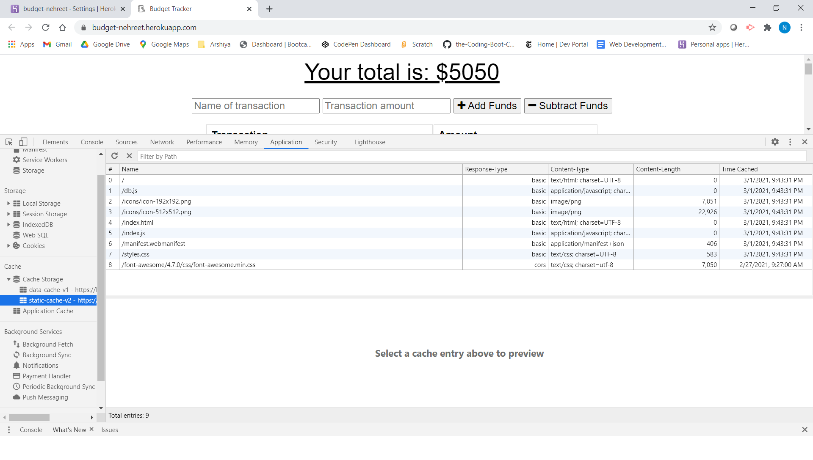

# ABOUT 
In this **application** **BUDGET_TRACKER**, user can enter the transaction and afterwords can edit the transaction by adding it the total or deducting it from the total amount of transaction. Have to create  **MANIFEST.WEBMANIFAST** file and also **SERVICE-WORKER.JS** file .In this **application** , worked with **MONGODB**,made **collection**,**DB-NAME**,**PASSWORD** setting on **MONGODB-ATLAS** means user have to login in MONGODB ATLAS to work with .and created the folder and file structure in **MVC** which stands for**MODEL VIEW CONTROLLER**  and also deployed our application on **HEROKU**.User can see all the **collections** and entered **exercises** in **ROBO 3T**.

# TABLE OF CONTENTS
[ DESCRIPTION](#DESCRIPTION)

[INSTALLATION](#INSTALLATION)

[TEXT-EDITOR](#TEXT-EDITOR)

[PROGRAMMING-LANGUAGE](#PROGRAMMING-LANGUAGE)

[RESOURCES-REFERRED](#RESOURCES-REFERRED)

[SCREENSHOT](#SCREENSHOT)

[GIT_HUB-REPOSITORY](#GIT_HUB-REPOSITORY)

[ HEROKU-LINK](#HEROKU-LINK) 

# DESCRIPTION

In this application , user will see the **BUDGET-TRACKER APP** by running
**node server.js** command on the terminal and listening to the port.
After,  connecting to the database, user will open the application in the browser
via **local host and the mentioned Port Number**. User will easily add the **name** of transaction and then add/deduct transaction cost from the total cost entered by the user. Graphical representation is also shown for the user. In this, user can enter the transaction name and cost even if it is offline which goes **indexed-db** and shown as pending and when user is back online and then it will be posted in the database. So, basically user can easily maintain it's budget even when offline.Also, created **Manifest.webmanifest** file and entered our file discription and our **icons** too and also created **service-worker.js** file . Both files links included in index.html file.Also, user can enter the files to **cache** in service-worker.js. **IT'S VERY IMPORTANT TO CLEAR DATA** for better working of application.

# INSTALLATION

**npm install MONGODB**

**npm install ROBO 3T**

## TEXT-EDITOR
**Vs-code**

## PROGRAMMING-LANGUAGE

CSS

JAVASCRIPT

HTML 

# RESOURCES-REFERRED
[MANIFEST-FILE](https://web.dev/add-manifest/)

[SERVICE-WORKER](https://developers.google.com/web/fundamentals/primers/service-workers)

[MVC](https://www.tutorialspoint.com/mvc_framework/mvc_framework_introduction.htm)

# SCREENSHOT

## Screenshot below shows the created **ICONS**

## Screenshot below shows the **CACHE-FILES**

## Screenshot below shows the transaction entered when network OFFLINE.

## Screenshot below shows the transaction entered in database when back ONLINE.

# GIT_HUB-REPOSITORY
[GIT-HUB](https://github.com/priteshpatel823/budget-tracker)

# HEROKU-LINK
[HEROKU-LINK](https://pritesh-budget-tracker.herokuapp.com/)

